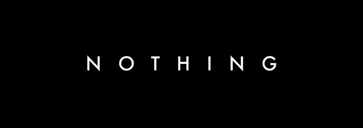

<div align="center">



# 🎵 Nothing Music

### *Your Server, But Cinematic With Sound*

[](https://discord.gg/w77ymEU82a)
[](https://discord.com/oauth2/authorize?client_id=1234592539324059709&permissions=414530792793&integration_type=0&scope=bot+applications.commands)
[](https://nothing-muisc.vercel.app)
[](https://nextjs.org)
[](LICENSE)

<br />

> **A modern Discord music bot with a powerful web dashboard built using Next.js.**
> Supports high-quality streaming, playlists, and advanced server controls.

<br />

| 🎧 50 Lakh+ Users | 🌐 4500+ Active Servers | ⚡ 99.4% Uptime | 🚀 30ms Avg Ping |
|:---:|:---:|:---:|:---:|

</div>

---

## 📋 Table of Contents

- [✨ Overview](#-overview)
- [🚀 Key Features](#-key-features)
- [🤖 Available Bots](#-available-bots)
- [🛠️ Tech Stack](#️-tech-stack)
- [⚡ Quick Start](#-quick-start)
- [📁 Project Structure](#-project-structure)
- [⚙️ Configuration](#️-configuration)
- [🎵 Bot Commands](#-bot-commands)
- [📸 Screenshots](#-screenshots)
- [🤝 Contributing](#-contributing)
- [📄 License](#-license)
- [💬 Support](#-support)

---

## ✨ Overview

**Nothing Music** is a next-generation Discord music bot paired with a sleek, professional web dashboard. It delivers crystal-clear audio, powerful queue management, smart playlists, and a seamless listening experience for your entire Discord community.

Whether you're running a chill lounge server or a busy community hub, Nothing Music keeps the vibe going — reliably, beautifully, and without interruption.

<div align="center">

```
🎵  Play music from YouTube, Spotify, SoundCloud & more
🎧  320kbps crystal-clear audio streaming
📋  Smart queue with skip, loop, shuffle & vote-skip
🎼  Unlimited custom playlists per server
🎤  Real-time lyrics in Discord
🎛️  Audio filters: bass boost, nightcore, 8D & reverb
⚡  30ms average response time
🔁  24/7 non-stop music mode with auto-reconnect
```

</div>

---

## 🚀 Key Features

<table>
<tr>
<td width="50%">

### 🎵 Music & Playback
- 🔊 **320kbps High-Quality Audio** — Studio-grade streaming for Discord voice channels
- ⚡ **Low-Latency Delivery** — 30ms average ping keeps playback smooth and lag-free
- 📻 **Multi-Source Support** — YouTube, Spotify, SoundCloud, Apple Music & more
- 🔄 **Auto Volume Normalization** — Balanced audio levels across all tracks

</td>
<td width="50%">

### 📋 Queue & Controls
- 🎛️ **Smart Queue System** — Skip, jump, loop, and reorder tracks with ease
- 🔀 **Shuffle Mode** — Randomize your queue while keeping it safe
- 🗳️ **Vote-Skip** — Democratic skip system for public channels
- ⏭️ **Instant Track Control** — Pause, resume, seek in real-time

</td>
</tr>
<tr>
<td width="50%">

### 🎼 Playlists
- 📁 **Unlimited Custom Playlists** — Create and save your best mixes
- 🔗 **Import from Links** — Add playlists directly from external URLs
- 🤝 **Shared Server Playlists** — Collaborate with your entire server
- ▶️ **One-Command Start** — Load a full playlist with a single command

</td>
<td width="50%">

### 🎛️ Audio Filters
- 🔈 **Bass Boost** — Deep, punchy bass enhancement
- 🌙 **Nightcore** — Speed and pitch boost for energetic vibes
- 🔮 **8D Audio** — Immersive spatial sound experience
- 🎚️ **Reverb Presets** — Atmospheric ambiance for any mood

</td>
</tr>
<tr>
<td width="50%">

### 🤖 Smart Features
- 🧠 **AI Recommendations** — Personalized music picks based on listening habits
- 🔍 **Advanced Search** — Keyword and URL search across all music platforms
- 🎤 **Real-time Lyrics** — Instant lyrics display directly in Discord
- 📊 **Session Stats** — Track history and now-playing rich embeds

</td>
<td width="50%">

### 🛡️ Reliability
- 🔁 **24/7 Music Mode** — Non-stop radio with auto-reconnect on drop
- 🔒 **Stable Long Sessions** — Built for high-traffic servers
- 🌐 **Regional Voice Routing** — Optimized node selection for low latency
- ♻️ **Queue Resume** — Picks up exactly where it left off after restart

</td>
</tr>
</table>

---

## 🤖 Available Bots

We offer multiple bot variants to suit every server's needs:

| Bot | Type | Best For | Invite |
|-----|------|----------|--------|
|  **Nothing Music** | 🆓 Free | Standard servers — full music features at no cost | [Invite ↗](https://discord.com/oauth2/authorize?client_id=1234592539324059709&permissions=414530792793&integration_type=0&scope=bot+applications.commands) |
|  **Nothing Canary** | 🆓➕💎 Free + Premium | Beta testers & early adopters who want new features first | [Invite ↗](https://discord.com/oauth2/authorize?client_id=1131938711639183363&permissions=414530792793&integration_type=0&scope=bot+applications.commands) |
|  **Nothing Prime** | 💎 Premium | Power users who need advanced audio, no limits & priority support | [Invite ↗](https://discord.com/oauth2/authorize?client_id=1254639840213991537&permissions=414530792793&integration_type=0&scope=bot+applications.commands) |
|  **Flame** | 🔥 All-in-One | Servers needing antinuke, security & moderation alongside music | [Invite ↗](https://discord.com/oauth2/authorize?client_id=1259218811131793479&permissions=414530792793&integration_type=0&scope=bot+applications.commands) |

---

## 🛠️ Tech Stack

| Category | Technology | Version |
|----------|------------|---------|
| 🌐 **Frontend Framework** | [Next.js](https://nextjs.org) | 16.x |
| ⚛️ **UI Library** | [React](https://react.dev) | 19.x |
| 🎨 **Styling** | [Tailwind CSS](https://tailwindcss.com) | 4.x |
| 🔣 **Icons** | [React Icons](https://react-icons.github.io/react-icons/) | 5.x |
| 🚀 **Deployment** | [Vercel](https://vercel.com) | Latest |
| 📦 **Package Manager** | npm | Latest |
| 🤖 **Bot Runtime** | Discord.js | — |

---

## ⚡ Quick Start

### Prerequisites

Make sure you have the following installed:

- **Node.js** `v18+` — [Download](https://nodejs.org)
- **npm** `v9+` (comes with Node.js)
- A Discord bot token — [Discord Developer Portal](https://discord.com/developers/applications)

---

### 1️⃣ Clone the Repository

```bash
git clone https://github.com/DevNest-Prince/Nothing-Muisc.git
cd Nothing-Muisc
```

### 2️⃣ Install Dependencies

```bash
cd client
npm install
```

### 3️⃣ Set Up Environment Variables

```bash
cp .env.example .env.local
```

Open `.env.local` and fill in your values (see [Configuration](#️-configuration)).

### 4️⃣ Run the Development Server

```bash
npm run dev
```

Open [http://localhost:3000](http://localhost:3000) in your browser to see the dashboard. 🎉

### 5️⃣ Build for Production

```bash
npm run build
npm start
```

---

## 📁 Project Structure

```
Nothing-Muisc/
└── client/                          # Next.js web dashboard
    ├── public/                      # Static assets (images, logos)
    │   ├── nothing-music-banner.png # Main project banner
    │   ├── Nothing 1 logo.png       # Nothing Music bot logo
    │   ├── Nothing Canary logo.png  # Nothing Canary logo
    │   ├── Nothing Prime logo.webp  # Nothing Prime logo
    │   └── Flame logo.png           # Flame bot logo
    ├── src/
    │   ├── app/                     # Next.js App Router pages
    │   │   ├── page.js              # Home page
    │   │   ├── features/            # Features showcase page
    │   │   ├── bots/                # Bot listing page
    │   │   ├── commands/            # Commands reference page
    │   │   ├── docs/                # Documentation page
    │   │   ├── faq/                 # FAQ page
    │   │   ├── about/               # About page
    │   │   ├── contact/             # Contact page
    │   │   ├── privacy-policy/      # Privacy policy
    │   │   ├── terms-of-service/    # Terms of service
    │   │   ├── layout.js            # Root layout with Header & Footer
    │   │   └── globals.css          # Global styles
    │   ├── components/              # Reusable UI components
    │   │   ├── Header.js            # Navigation header
    │   │   ├── Footer.js            # Site footer
    │   │   ├── HeroSection.js       # Hero section component
    │   │   ├── FeatureGrid.js       # Feature grid layout
    │   │   ├── BotCard.js           # Bot listing card
    │   │   ├── CommandCard.js       # Command reference card
    │   │   ├── Button.js            # Reusable button component
    │   │   ├── Alert.js             # Alert/notification component
    │   │   ├── FAQItem.js           # FAQ accordion item
    │   │   └── SectionHeader.js     # Reusable section header
    │   ├── config/
    │   │   ├── site.js              # Site-wide config, features, commands & bot data
    │   │   ├── metadata.js          # SEO metadata helpers
    │   │   └── api.js               # API endpoint configuration
    │   └── utils/
    │       └── helpers.js           # Shared utility functions
    ├── next.config.mjs              # Next.js configuration
    ├── postcss.config.mjs           # PostCSS / Tailwind config
    ├── eslint.config.mjs            # ESLint configuration
    ├── jsconfig.json                # JS path aliases
    ├── vercel.json                  # Vercel deployment config
    └── package.json                 # Dependencies and scripts
```

---

## ⚙️ Configuration

### Environment Variables

Create a `.env.local` file inside the `client/` directory with the following variables:

```env
# Site URL (used for SEO / Open Graph)
NEXT_PUBLIC_SITE_URL=https://nothing-muisc.vercel.app

# API base URL (if you have a backend API)
NEXT_PUBLIC_API_URL=https://your-api-url.com
```

### Site Configuration

All core site settings are managed in `client/src/config/site.js`:

```js
export const SITE_CONFIG = {
  name: 'Nothing',
  title: 'Nothing - Discord Music Bot',
  bot: {
    prefix: '!!',            // Default command prefix
    inviteUrl: '...',        // Bot OAuth2 invite URL
  },
  links: {
    github: '...',           // GitHub profile URL
    discord: '...',          // Support server invite
    hostingPartner: '...',   // Hosting partner URL
  },
  features: {
    showCommandsPage: false, // Toggle commands page visibility
  },
};
```

### Discord Bot Setup

1. Go to the [Discord Developer Portal](https://discord.com/developers/applications)
2. Create a **New Application** and add a **Bot** user
3. Enable the following **Privileged Gateway Intents**:
   - ✅ Server Members Intent
   - ✅ Message Content Intent
4. Copy your **Bot Token** and add it to your environment variables
5. Generate an invite URL with the following permissions:
   - `Connect`, `Speak`, `Send Messages`, `Embed Links`, `Read Message History`

---

## 🎵 Bot Commands

The default prefix for Nothing Music is `!!`

| Command | Aliases | Category | Description |
|---------|---------|----------|-------------|
| `!!play <song>` | `p` | 🎵 Music | Play a song or playlist by name or URL |
| `!!skip` | `s`, `next` | 🎵 Music | Skip the current song |
| `!!stop` | `leave` | 🎵 Music | Stop playing and disconnect from voice channel |
| `!!pause` | `hold` | 🎵 Music | Pause the currently playing song |
| `!!resume` | `r` | 🎵 Music | Resume the paused song |
| `!!queue [page]` | `q` | 🎵 Music | Show the current music queue |
| `!!nowplaying` | `np`, `current` | ℹ️ Info | Show the currently playing song |
| `!!playlist create <name>` | `pl` | 📁 Playlist | Create or manage a playlist |
| `!!volume <0-100>` | `vol` | ⚙️ Settings | Set the bot volume (0–100%) |
| `!!lyrics` | `ly` | ℹ️ Info | Get lyrics for the currently playing song |

> 💡 **Tip:** You can also use slash commands — just type `/` in Discord and look for Nothing's commands.

---

## 📸 Screenshots

### 🏠 Home Page — Live Music Dashboard

<div align="center">

</div>

### 🌟 Share Banner

<div align="center">

</div>

> 🖥️ **Live Demo:** [nothing-muisc.vercel.app](https://nothing-muisc.vercel.app)

---

## 🤝 Contributing

We welcome contributions from the community! Here's how you can help:

### Getting Started

1. **Fork** the repository
2. **Clone** your fork locally:
   ```bash
   git clone https://github.com/YOUR_USERNAME/Nothing-Muisc.git
   ```
3. **Create** a new branch for your feature:
   ```bash
   git checkout -b feature/your-feature-name
   ```
4. **Make** your changes and commit them:
   ```bash
   git commit -m "feat: add your feature description"
   ```
5. **Push** to your fork:
   ```bash
   git push origin feature/your-feature-name
   ```
6. **Open** a Pull Request on GitHub

### Contribution Guidelines

- 📝 Follow the existing code style and component patterns
- ✅ Test your changes before submitting a PR
- 📦 Don't add unnecessary dependencies
- 💬 Describe your changes clearly in the PR description
- 🐛 Reference any issues your PR fixes with `Fixes #issue-number`

### What to Contribute

- 🐛 Bug fixes and stability improvements
- ✨ New features aligned with the project roadmap
- 📚 Documentation improvements
- 🎨 UI/UX enhancements
- 🌐 Translations and i18n support
- ⚡ Performance optimizations

---

## 📄 License

This project is licensed under the **MIT License** — see the [LICENSE](LICENSE) file for details.

```
MIT License — Copyright (c) 2026 DevNest-Prince
```

You are free to use, modify, and distribute this project as long as you include the original license notice.

---

## 💬 Support

Need help? Here's how to reach us:

<div align="center">

| Resource | Link |
|----------|------|
| 💬 **Discord Support Server** | [discord.gg/w77ymEU82a](https://discord.gg/w77ymEU82a) |
| 🐛 **Bug Reports & Feature Requests** | [GitHub Issues](https://github.com/DevNest-Prince/Nothing-Muisc/issues) |
| 📖 **Documentation** | [nothing-muisc.vercel.app/docs](https://nothing-muisc.vercel.app/docs) |
| ❓ **FAQ** | [nothing-muisc.vercel.app/faq](https://nothing-muisc.vercel.app/faq) |
| 🌐 **Website** | [nothing-muisc.vercel.app](https://nothing-muisc.vercel.app) |

</div>

### 🏢 Hosting Partner

<div align="center">

Proudly hosted with support from **[Glacier Hosting](https://glacierhosting.in/)**


</div>

---

<div align="center">

Made with ❤️ by [DevNest-Prince](https://github.com/DevNest-Prince)

⭐ **If you like this project, please give it a star!** ⭐

[](https://discord.gg/w77ymEU82a)
[](https://github.com/DevNest-Prince/Nothing-Muisc)

</div>
